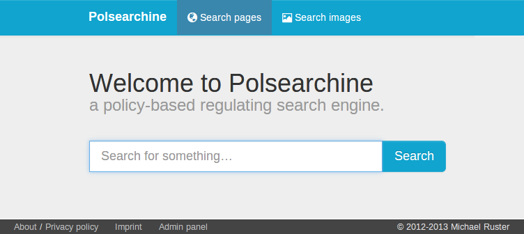
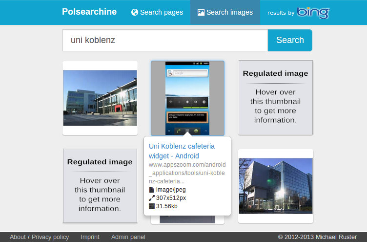
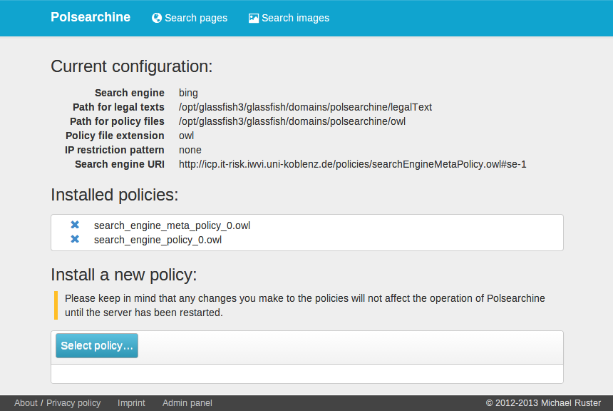

#Polsearchine
This is the source code of Polsearchine – a policy-based regulating search engine.
Due to licencing reasons, a fundamental library is missing.
It has been built using NetBeans 7.3.
Polsearchine is a Java EE 6 Web application which was developed to run on a [GlassFish Server Open Source Edition 3.1.2.2](https://glassfish.java.net/download-archive.html).

##Features
* Text-based search for text and image search
* Allows search for files with special `filetype:` operator
* Regulation of results possible through the [Information Flow Ontology (InFO)](http://www.worldscientific.com/doi/abs/10.1142/S1793351X15500014) developed by Scherp and Kasten
* Result regulations are marked explicitly as such and legitimating information will be displayed
* Graphical backend to easily add and remove regulation policies
* Policies are processed only once per Web server start
* Processed policies are stored in a database containing only indispensable information
* Includes a user and role system allowing users to login with a password
* All access is encrypted using TLS 1.0
* Interface built with Bootstrap v.3.0.0
* Replacing the backend search engine is easy

##Documentation
In general, the code is well-documented.
The associated JavaDoc can be generated if needed.
Additionally, extensive documentation is given through [the corresponding bachelor thesis](http://kola.opus.hbz-nrw.de/volltexte/2013/934/).

##Preview Images
Below, screenshots of the running Web application are shown.
Please note that the search queries are merely used as an example.
I do not endorse Stormfront and neither should you.

###The landing page

###Web results of which some have been filtered

###Image results of which some have been filtered

###Backend which displays the current configuration and allows changes to policies

